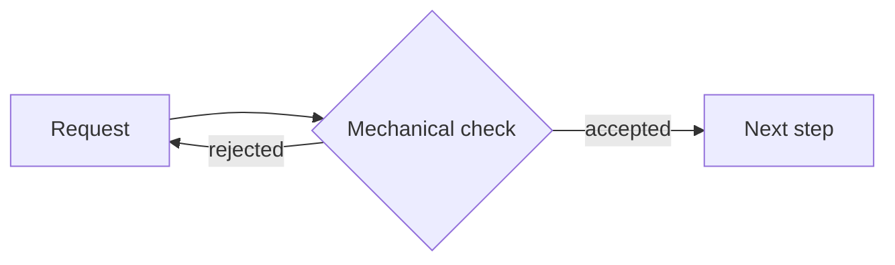

# Mermaid smoke diagram

A known-good diagram that is always present, so the Mermaid check runs the real renderer in CI
even before the documentation has any diagram of its own.

```mermaid
flowchart LR
  request[Request] --> gate{Mechanical check}
  gate -- accepted --> next[Next step]
  gate -- rejected --> request
```
